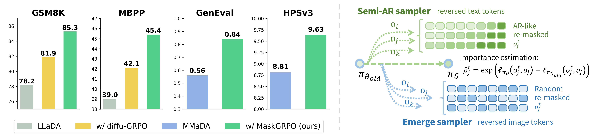

<div align="center">
 <h1> Consolidating Reinforcement Learning for Multimodal Discrete Diffusion Models </h1>

 University of Chinese Academy of Sciences
</div>

<p align="center">
 
</p>

This is the official implementation of MaskGRPO: [Consolidating Reinforcement Learning for Multimodal Discrete Diffusion Models](http://arxiv.org/abs/2510.02880)，an open-sourced framework for SFT and GRPO training of discrete diffusion models (DDMs) including LLaDA and MMaDA.

In this repo, we release:
  1. Improved **importance estimation** for reinforcing DDMs with controlled randomness across devices. 
  2. **AR-like reversing** for RL training on math reasoning and coding tasks. 
  3. **Emerge sampler** for image generation and RL training.
  4. Detailed SFT, RL and Evaluation scripts.

## 🚀 Quick Start
First, set up the enviroment with python==3.10 (please first read the comments in [requirements](requirements.txt)):
```
conda create -n maskgrpo python==3.10
conda activate maskgrpo
pip install torch==2.7.0 torchvision==0.22.0 torchaudio==2.7.0 --index-url https://download.pytorch.org/whl/cu128
pip install -r requirements.txt
pip install git+https://github.com/huggingface/trl.git@0f88c179e30b3439467942a08c3190f624d5c423
```

Then, download the [MMaDA](https://huggingface.co/Gen-Verse/MMaDA-8B-Base) and [LLaDA](https://huggingface.co/GSAI-ML/LLaDA-8B-Instruct) checkpoints, and **update related paths in `configs/*.yaml`** and **`scripts/train/*.sh`** accordingly.

You may also need to pre-download or prepare the datasets you want. Please refer to [data](training/data.py) or [data_utils](grpo/data_utils.py) for data management details.

### 📖 Math reasoning and coding (T2T tasks):
For math reasoning, run
```
bash scripts/train/t2t_grpo_train.sh
```
For coding, you have to first launch a sandbox using
```
bash scripts/train/run_e2b.sh
```
then you can run the training script.
### 🎨 Image generation (T2I tasks):
For SFT, use
```
bash scripts/train/t2i_sft.sh
```

For GRPO training with CLIP or HPSv2, use
```
bash scripts/train/t2i_grpo_train.sh
```

If you want to run with Unified-Reward, HPSv3 or other MLLM as servers, please launch the server (see [reward_func](grpo/reward_func.py) for communication protocols, [reward_server](https://github.com/yifan123/reward-server) for detailed configuration) and run
```
bash scripts/train/t2i_grpo_train_w_server.sh
```

## 🧑‍🏫 Evaluation
Just run the scripts in scripts/eval, get the results and evaluate them (the MBPP evaluation scripts will be updated soon).

As additional enviroments may need to be installed, please refer to the original benchmark repository for instructions. 

Here are more comparisons between the default MaskGIT-style results (before RL) and ours (after RL).


## 🧷 PS
Theoretically, [Lumina-Dimoo](https://github.com/Alpha-VLLM/Lumina-DiMOO) can also be supported, as it shares a similar structure to MMaDA. We welcome any PR or issue post on efficiency improvement and compatibility!

## 📜 Acknowledgement
This repository is built off of [MMaDA](https://github.com/Gen-Verse/MMaDA), [diffu-GRPO](https://github.com/dllm-reasoning/d1), [DiffuCoder](https://github.com/apple/ml-diffucoder), [MDLM](https://github.com/kuleshov-group/mdlm) and [ReDDiT](https://github.com/martian422/ReDDiT). Thanks to all the authors for their great work.

## 📄 BibTex
```
@article{ma2025MaskGRPO,
      title={Consolidating Reinforcement Learning for Multimodal Discrete Diffusion Models.}, 
      author={Tianren Ma and Mu Zhang and Yibing Wang and Qixiang Ye},
      year={2025},
      eprint={2510.02880},
      archivePrefix={arXiv},
      primaryClass={cs.CV}
}
```
